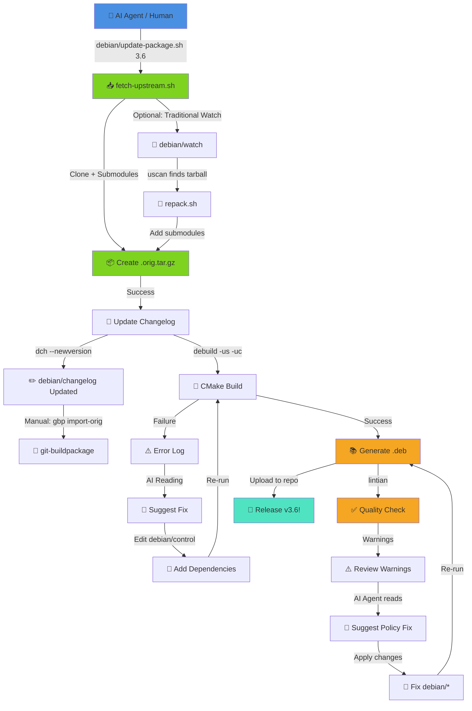

# WSClean Debian Packaging - Complete Automated Workflow

## Overview

This repository is set up for AI-assisted Debian packaging with automation scripts that handle upstream fetching, building, testing, and PPA uploads.

---

## 🎯 Quick Start

### In Codespace (Prepare & Test)
```bash
# Option 1: Test build only
debian/build-from-tarball.sh 3.6 noble

# Option 2: Full workflow (fetch → build → prepare)
debian/full-build.sh --distro noble
```

### On Local Machine (Sign & Upload)
```bash
# Clone the repo
git clone git@github.com:kernsuite-debian/wsclean.git
cd wsclean

# One command to upload to both PPAs (default)
debian/local-build-and-upload.sh

# Or specify PPAs explicitly
debian/local-build-and-upload.sh ppa:kernsuite/kern-dev ppa:kernsuite/kern-10

# Or just one PPA
debian/local-build-and-upload.sh ppa:kernsuite/kern-dev
```

---

## 📊 Workflow Diagram



## 🛠️ Available Scripts

### Codespace / Development Environment

| Script | Purpose | Usage |
|--------|---------|-------|
| `fetch-upstream.sh` | Clone upstream with submodules | `debian/fetch-upstream.sh 3.6` |
| `fetch-latest.sh` | Auto-detect and fetch latest version | `debian/fetch-latest.sh` |
| `build-from-tarball.sh` | Build from clean extracted tarball | `debian/build-from-tarball.sh 3.6 noble` |
| `full-build.sh` | Complete workflow: fetch → build → sign | `debian/full-build.sh --distro noble` |
| `install-build-deps.sh` | Install build dependencies | `debian/install-build-deps.sh` |
| `test-install.sh` | Test package installation | `debian/test-install.sh 3.6` |
| `verify-setup.sh` | Verify development environment | `debian/verify-setup.sh` |

### Local Machine (with GPG key)

| Script | Purpose | Usage |
|--------|---------|-------|
| `local-build-and-upload.sh` | Complete local workflow | `debian/local-build-and-upload.sh [PPA1 PPA2...]` |
| `pdebuild-local.sh` | Clean-room build test | `debian/pdebuild-local.sh` |

---

## 🔄 Complete Workflow

### Phase 1: Codespace (Prepare Release)

```bash
# 1. Start in Codespace
# Environment is pre-configured with all tools

# 2. Fetch and build
debian/fetch-upstream.sh 3.6

# 3. Test build
debian/build-from-tarball.sh 3.6 noble

# 4. If successful, commit changes
git add debian/
git commit -m "Prepare wsclean 3.6-1kern1 for noble"

# 5. Tag the release
git tag debian/3.6-1kern1
git tag upstream/3.6

# 6. Push everything
git push origin master upstream pristine-tar
git push origin --tags
```

### Phase 2: Local Machine (Sign & Upload)

```bash
# 1. Clone on your local machine (with GPG key)
git clone git@github.com:kernsuite-debian/wsclean.git
cd wsclean

# 2. Run the automated workflow (uploads to both PPAs by default)
debian/local-build-and-upload.sh

# This will:
# - Check/create upstream tarball
# - (Optional) Run pdebuild clean-room test
# - Build signed source package
# - Verify GPG signature
# - Upload to kern-dev and kern-10 PPAs
```

---

## 🤖 AI-Assisted Debugging

When builds fail, the AI agent can help by:

### 1. Dependency Issues
```
Error: CMakeLists.txt requires FFTW3, but package fails
```
**AI reads:** `CMakeLists.txt`, `debian/control`  
**AI suggests:** Add `libfftw3-dev` to Build-Depends

### 2. Lintian Warnings
```
W: wsclean: package-contains-empty-directory usr/share/doc/
```
**AI reads:** Lintian output, Debian Policy  
**AI suggests:** Remove empty directory or add documentation

### 3. Build Failures
```
Error: undefined reference to `casacore::Table::Table()'
```
**AI reads:** Build log, linker errors  
**AI suggests:** Missing library dependency or link order issue

---

## 📋 Version Management

### Version Numbering Scheme

- **Upstream version**: `3.6` (from upstream git tag `v3.6`)
- **Debian revision**: `1kern1` (KERN's first package of Debian revision 1)

### Increment Rules

| Scenario | Old Version | New Version | When |
|----------|-------------|-------------|------|
| New upstream release | `3.5-1kern1` | `3.6-1kern1` | Upstream releases v3.6 |
| Rebuild without changes | `3.6-1kern1` | `3.6-1kern2` | Rebuild for testing |
| Debian packaging changes | `3.6-1kern1` | `3.6-2kern1` | Add/modify patches |

The `build-and-sign.sh` script automatically increments `kern` numbers when rebuilding the same version.

---

## 🔍 Testing Checklist

Before uploading to PPA:

- [ ] **Build test**: `debian/build-from-tarball.sh 3.6 noble`
- [ ] **Clean-room test**: `pdebuild` (ensures all deps are declared)
- [ ] **Lintian check**: `lintian ../wsclean_*.deb`
- [ ] **Installation test**: `debian/test-install.sh 3.6`
- [ ] **Functional test**: `wsclean --version` and test imaging

---

## 📦 Package Structure

After building, you get:

```
../
├── wsclean_3.6.orig.tar.gz              # Upstream source
├── wsclean_3.6-1kern1.debian.tar.xz     # Debian packaging
├── wsclean_3.6-1kern1.dsc               # Source package descriptor
├── wsclean_3.6-1kern1_source.changes    # Source upload (for PPA)
├── wsclean_3.6-1kern1_amd64.deb         # Binary package: wsclean
├── wsclean-dev_3.6-1kern1_amd64.deb     # Binary package: dev files
└── libwsclean2_3.6-1kern1_amd64.deb     # Binary package: library
```

---

## 🚀 PPA Upload

### Prerequisites (Local Machine Only)
1. GPG key configured: `gpg --list-secret-keys`
2. Launchpad account with PPA access
3. GPG key uploaded to Launchpad

### Upload Command
```bash
# Upload to both kern-dev and kern-10 (default)
dput ppa:kernsuite/kern-dev ../wsclean_3.6-1kern1_source.changes
dput ppa:kernsuite/kern-10 ../wsclean_3.6-1kern1_source.changes

# Or use the automated script
debian/local-build-and-upload.sh

# Upload to custom PPAs
debian/local-build-and-upload.sh ppa:myteam/myrepo
debian/local-build-and-upload.sh ppa:kernsuite/kern-dev ppa:another/ppa
```

### Track Build Status
- kern-dev: https://launchpad.net/~kernsuite/+archive/ubuntu/kern-dev/+packages
- kern-10: https://launchpad.net/~kernsuite/+archive/ubuntu/kern-10/+packages

---

## 🐛 Troubleshooting

### "No upstream tarball found"
```bash
# Fetch it first
debian/fetch-upstream.sh 3.6
```

### "Unmet build dependencies"
```bash
# Install them automatically
debian/install-build-deps.sh
```

### "Binary file contents changed" (dpkg-source error)
```bash
# Build from clean tarball instead
debian/build-from-tarball.sh 3.6 noble
```

### "pdebuild failed"
```bash
# Check pbuilder is configured with kern-10 PPA
# See /etc/pbuilder/hooks/D05add-kern-10
```

---

## 📚 Additional Documentation

- Full guide: `debian/AI-PACKAGING.md`
- Quick reference: `debian/QUICKREF.md`
- Dependency inspector: `debian/inspect-deps.py`

---

## 🤝 Contributing

When updating to a new version:

1. Update in Codespace (AI can help!)
2. Test thoroughly with the scripts
3. Push changes and tags
4. Clone locally and upload to PPA

---

**Maintained by:** KERN packaging team  
**Questions?** Open an issue on GitHub
